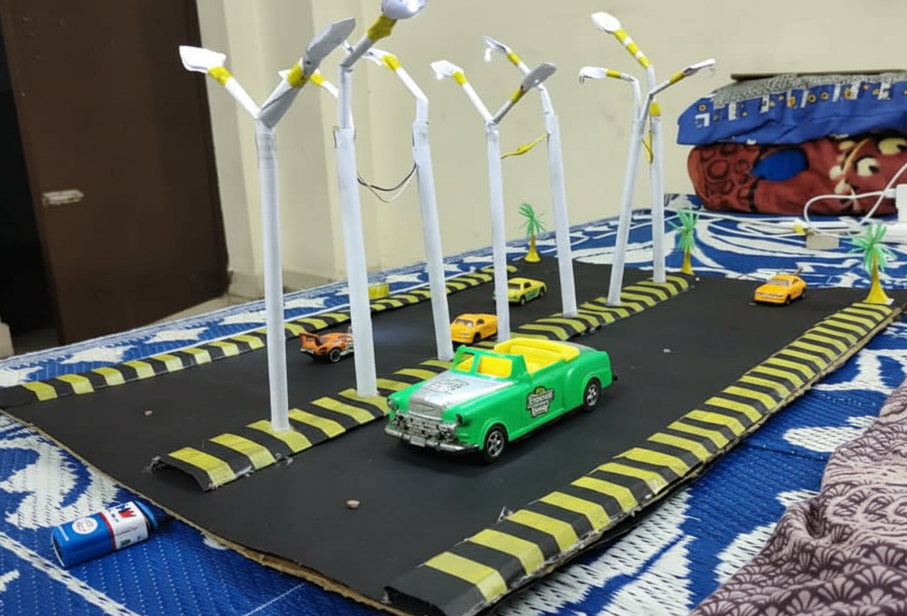
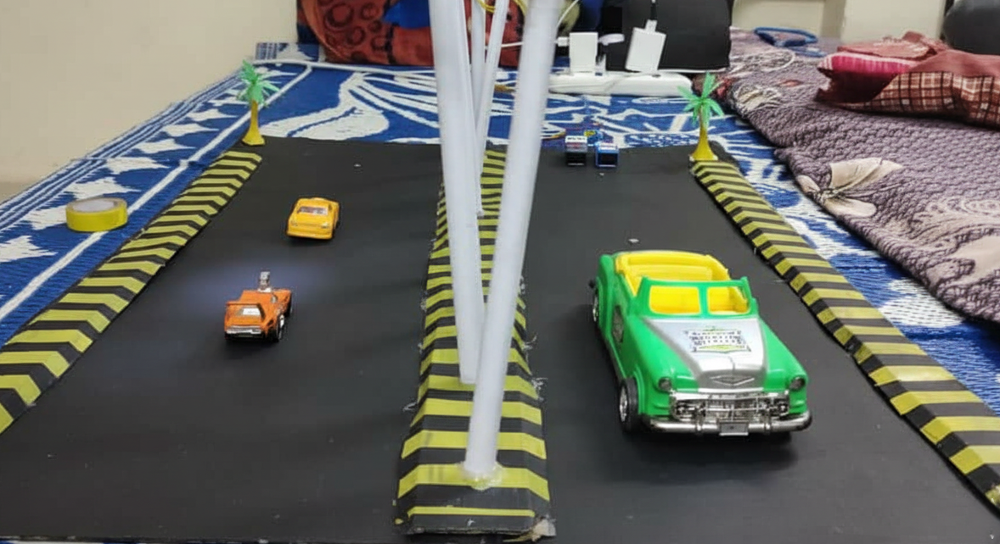

# Smart Street Light System
### Working Model

## 🔹 Description

This project is an automatic street lighting system that operates based on surrounding light conditions. It uses an LDR sensor to detect light intensity and automatically controls the street light.

## 🔹 Features

* Automatic ON/OFF system
* Works without microcontroller
* Energy efficient
* Simple and low-cost design

## 🔹 Components Used

* LDR (Light Dependent Resistor)
* Transistor
* Resistors
* LED Lamp
* Battery

## 🔹 Working Principle

During daytime, the LDR senses high light intensity, so the street light remains OFF.

During nighttime, the LDR detects low light conditions, activating the circuit.

When additional light (like vehicle headlights) falls on the LDR, the transistor triggers and turns ON the street light.

## 🔹 Advantages

* Saves electricity
* No manual operation needed
* Easy to implement

## 🔹 Applications

* Street lighting systems
* Highways
* Rural areas

## 🔹 Future Improvements

* Add ESP32 for smart control
* Add motion sensors for better detection

